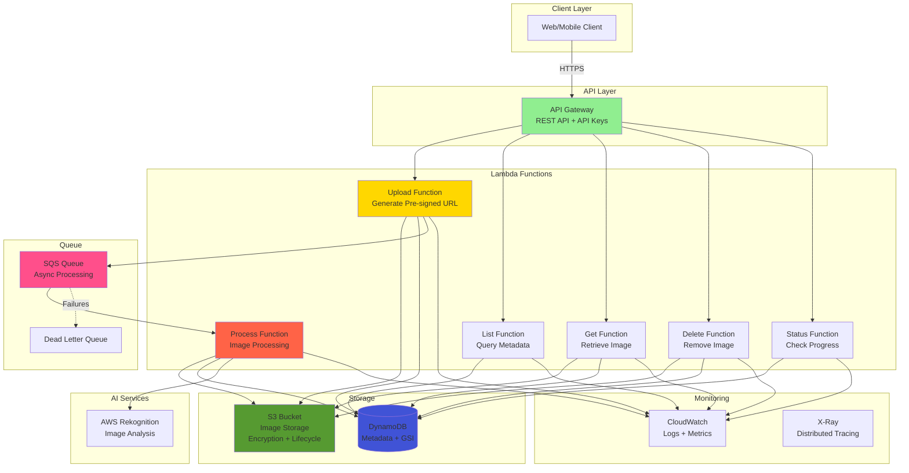
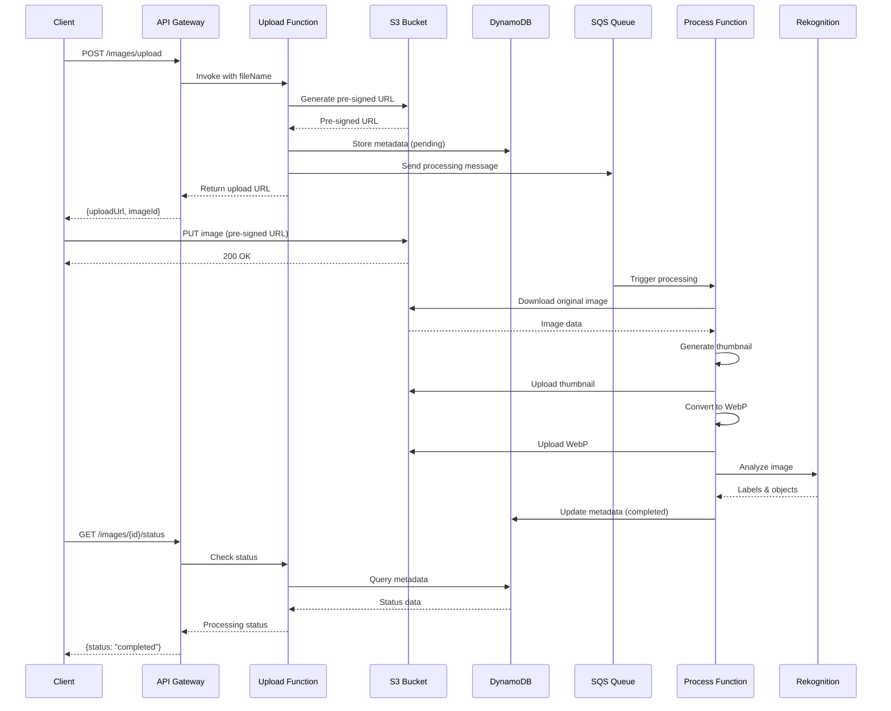

# Serverless API - Enterprise Image Processing Platform

<div align="center">


**Production-grade serverless image processing API with AI-powered analysis and automated deployment**

[Features](#features) • [Architecture](#architecture) • [Quick Start](#quick-start) • [API Reference](#api-reference) • [Deployment](#deployment)

</div>

---

## Table of Contents

- [Overview](#overview)
- [Features](#features)
- [Tech Stack](#tech-stack)
- [Architecture](#architecture)
- [Project Structure](#project-structure)
- [Prerequisites](#prerequisites)
- [Quick Start](#quick-start)
- [API Reference](#api-reference)
- [Testing](#testing)
- [CI/CD Pipeline](#cicd-pipeline)
- [Deployment](#deployment)
- [Configuration](#configuration)
- [Cost Optimization](#cost-optimization)
- [Monitoring](#monitoring)
- [Troubleshooting](#troubleshooting)

---

## Overview

Enterprise-grade **serverless image processing platform** built on AWS Lambda. Demonstrates modern cloud-native architecture with event-driven design, AI integration, and comprehensive infrastructure as code.

### Key Highlights

- **Serverless architecture** with AWS Lambda and API Gateway
- **AI-powered image analysis** using AWS Rekognition
- **Automatic image optimization** (thumbnails, WebP conversion)
- **Event-driven processing** with SQS and async workflows
- **Infrastructure as Code** using AWS SAM
- **Complete CI/CD pipeline** with GitHub Actions
- **Auto-scaling** and pay-per-use pricing
- **Production-ready** monitoring and observability

---

## Features

### 🖼️ Image Processing
- Pre-signed URL upload to S3
- Automatic thumbnail generation (multiple sizes)
- WebP conversion for optimization
- Image metadata extraction
- EXIF data processing
- Secure access control

### 🤖 AI Analysis
- Object detection (AWS Rekognition)
- Label identification
- Scene classification
- Content moderation
- Celebrity recognition

### 💾 Storage & Metadata
- S3 bucket with lifecycle policies
- DynamoDB for metadata storage
- Global Secondary Index for queries
- TTL-based automatic cleanup
- Versioning and backup

### ⚡ Async Processing
- SQS queue for background jobs
- Dead Letter Queue (DLQ) for failures
- Retry mechanisms with exponential backoff
- Status tracking

### 🔒 Security
- API Gateway with API key authentication
- Usage plans and throttling
- S3 bucket encryption at rest
- IAM least privilege policies
- Pre-signed URLs with expiration
- VPC integration ready

---

## Tech Stack

### Cloud Platform


### Runtime & Development


### Infrastructure & CI/CD


---

## Architecture

### System Architecture



### Image Processing Workflow



---

## Project Structure

```
serverless-api/
├── .github/
│   └── workflows/
│       └── deploy.yml            # CI/CD pipeline
├── src/
│   ├── functions/
│   │   ├── upload/
│   │   │   └── index.js          # Upload function
│   │   ├── list/
│   │   │   └── index.js          # List images function
│   │   ├── get/
│   │   │   └── index.js          # Get image function
│   │   ├── delete/
│   │   │   └── index.js          # Delete image function
│   │   ├── process/
│   │   │   └── index.js          # Image processing function
│   │   └── status/
│   │       └── index.js          # Status check function
│   └── layers/
│       └── common/
│           └── nodejs/
│               └── package.json  # Shared dependencies
├── tests/
│   ├── unit/
│   │   └── upload.test.js        # Unit tests
│   └── setup.js                  # Test configuration
├── template.yaml                  # AWS SAM template
├── samconfig.toml                 # SAM configuration
├── package.json                   # Dependencies
├── jest.config.js                 # Test configuration
└── README.md                      # This file
```

---

## Prerequisites

- **AWS Account** with appropriate permissions
- **AWS CLI** installed and configured
- **AWS SAM CLI** installed
- **Node.js 18+**
- **Docker** (for local testing)

### Install AWS SAM CLI

**Windows (Chocolatey):**
```bash
choco install aws-sam-cli
```

**macOS:**
```bash
brew install aws-sam-cli
```

**Verify Installation:**
```bash
sam --version
aws --version
```

---

## Quick Start

### 1. Clone the Repository

```bash
git clone https://github.com/naveed-gung/serverless-api.git
cd serverless-api
```

### 2. Install Dependencies

```bash
npm install
cd src/layers/common/nodejs && npm install && cd ../../../..
```

### 3. Configure AWS Credentials

```bash
aws configure
```

### 4. Deploy to AWS

```bash
sam build
sam deploy --guided
```

Follow the prompts to configure your deployment:
- Stack name
- AWS Region
- Confirm changes before deploy
- Allow SAM CLI IAM role creation
- Save arguments to configuration file

### 5. Test the API

Get the API endpoint from the deployment output:

```bash
# Upload an image
curl -X POST https://your-api-id.execute-api.region.amazonaws.com/Prod/images/upload \
  -H "x-api-key: YOUR_API_KEY" \
  -H "Content-Type: application/json" \
  -d '{"fileName": "test.jpg"}'

# List images
curl -X GET https://your-api-id.execute-api.region.amazonaws.com/Prod/images \
  -H "x-api-key: YOUR_API_KEY"

# Check status
curl -X GET https://your-api-id.execute-api.region.amazonaws.com/Prod/images/{imageId}/status \
  -H "x-api-key: YOUR_API_KEY"
```

---

## API Reference

### Upload Image

**Endpoint:** `POST /images/upload`

**Headers:**
- `x-api-key`: Your API key

**Request Body:**
```json
{
  "fileName": "example.jpg"
}
```

**Response:**
```json
{
  "uploadUrl": "https://...",
  "imageId": "uuid",
  "expiresIn": 3600
}
```

### List Images

**Endpoint:** `GET /images`

**Headers:**
- `x-api-key`: Your API key

**Query Parameters:**
- `limit` (optional): Number of images to return (default: 10)
- `lastKey` (optional): For pagination

**Response:**
```json
{
  "images": [
    {
      "imageId": "uuid",
      "fileName": "example.jpg",
      "uploadDate": "2025-10-13T12:00:00Z",
      "status": "completed",
      "thumbnailUrl": "https://...",
      "webpUrl": "https://..."
    }
  ],
  "lastKey": "uuid"
}
```

### Get Image

**Endpoint:** `GET /images/{imageId}`

**Headers:**
- `x-api-key`: Your API key

**Response:**
```json
{
  "imageId": "uuid",
  "fileName": "example.jpg",
  "originalUrl": "https://...",
  "thumbnailUrl": "https://...",
  "webpUrl": "https://...",
  "metadata": {
    "width": 1920,
    "height": 1080,
    "format": "jpeg",
    "size": 245678
  },
  "aiAnalysis": {
    "labels": ["Person", "Outdoor", "Smile"],
    "confidence": 98.5
  }
}
```

### Delete Image

**Endpoint:** `DELETE /images/{imageId}`

**Headers:**
- `x-api-key`: Your API key

**Response:**
```json
{
  "message": "Image deleted successfully",
  "imageId": "uuid"
}
```

### Check Processing Status

**Endpoint:** `GET /images/{imageId}/status`

**Headers:**
- `x-api-key`: Your API key

**Response:**
```json
{
  "imageId": "uuid",
  "status": "completed",
  "progress": 100,
  "message": "Processing completed successfully"
}
```

**Status Values:**
- `pending`: Upload initiated, processing not started
- `processing`: Image is being processed
- `completed`: Processing finished successfully
- `failed`: Processing failed

---

## Testing

### Run Unit Tests

```bash
npm test
```

### Run Tests with Coverage

```bash
npm test -- --coverage
```

### Test Individual Functions Locally

```bash
# Test upload function
sam local invoke UploadFunction -e events/upload.json

# Test list function
sam local invoke ListFunction -e events/list.json
```

### Start Local API

```bash
sam local start-api
```

Access the local API at `http://localhost:3000`

---

## CI/CD Pipeline

This project uses **GitHub Actions** for continuous integration and deployment.

### Workflow Triggers

- Push to `main` branch
- Pull requests to `main`

### Pipeline Stages

1. **Lint & Test**
   - ESLint code quality checks
   - Jest unit tests
   - Coverage reporting

2. **Build**
   - SAM build
   - Dependency installation
   - Artifact creation

3. **Deploy**
   - Deploy to staging environment
   - Run integration tests
   - Deploy to production (manual approval)

### Setup GitHub Actions

1. Add AWS credentials to GitHub Secrets:
   - `AWS_ACCESS_KEY_ID`
   - `AWS_SECRET_ACCESS_KEY`

2. Configure environment variables in `.github/workflows/deploy.yml`

3. Push to trigger the pipeline

---

## Deployment

### Development Environment

```bash
sam deploy --config-env dev
```

### Staging Environment

```bash
sam deploy --config-env staging
```

### Production Environment

```bash
sam deploy --config-env prod --no-confirm-changeset
```

### Multi-Region Deployment

```bash
# Deploy to us-east-1
sam deploy --region us-east-1 --stack-name serverless-api-us-east

# Deploy to eu-west-1
sam deploy --region eu-west-1 --stack-name serverless-api-eu-west
```

---

## Configuration

### Environment Variables

Configure in `template.yaml`:

```yaml
Environment:
  Variables:
    BUCKET_NAME: !Ref ImageBucket
    TABLE_NAME: !Ref ImageTable
    QUEUE_URL: !Ref ProcessingQueue
    REKOGNITION_ROLE_ARN: !GetAtt RekognitionRole.Arn
```

### API Key Management

```bash
# Get API key
aws apigateway get-api-keys --include-values

# Create new API key
aws apigateway create-api-key --name MyAPIKey --enabled
```

### Adjust Lambda Memory and Timeout

Edit `template.yaml`:

```yaml
MemorySize: 1024  # MB
Timeout: 30       # seconds
```

---

## Cost Optimization

### Estimated Monthly Costs

For **10,000 image uploads** per month:

| Service | Usage | Cost |
|---------|-------|------|
| Lambda | 60,000 invocations, 1GB memory | $1.20 |
| API Gateway | 60,000 requests | $0.06 |
| S3 | 10GB storage, 20K requests | $0.50 |
| DynamoDB | 100K reads, 50K writes | $0.25 |
| SQS | 20K messages | $0.01 |
| Rekognition | 10K images analyzed | $10.00 |
| **Total** | | **~$12.02** |

### Cost Reduction Tips

1. **Enable S3 Lifecycle Policies**
   - Move to Glacier after 90 days
   - Delete old thumbnails

2. **Use DynamoDB On-Demand**
   - Pay per request for unpredictable workloads

3. **Optimize Lambda Memory**
   - Right-size based on CloudWatch metrics

4. **Cache API Responses**
   - Enable API Gateway caching

5. **Use S3 Intelligent-Tiering**
   - Automatic cost optimization

---

## Monitoring

### CloudWatch Dashboards

View key metrics:
- Lambda invocation count and errors
- API Gateway request count and latency
- SQS queue depth
- DynamoDB read/write capacity

### Set Up Alarms

```bash
# High error rate alarm
aws cloudwatch put-metric-alarm \
  --alarm-name high-error-rate \
  --metric-name Errors \
  --namespace AWS/Lambda \
  --statistic Sum \
  --period 300 \
  --threshold 10 \
  --comparison-operator GreaterThanThreshold
```

### X-Ray Tracing

Enable X-Ray in `template.yaml`:

```yaml
Globals:
  Function:
    Tracing: Active
```

View traces in AWS X-Ray console.

### Logs Analysis

```bash
# View Lambda logs
sam logs -n UploadFunction --tail

# Query logs with CloudWatch Insights
aws logs start-query \
  --log-group-name /aws/lambda/UploadFunction \
  --start-time $(date -d '1 hour ago' +%s) \
  --end-time $(date +%s) \
  --query-string 'fields @timestamp, @message | filter @message like /ERROR/'
```

---

## Troubleshooting

### Common Issues

#### Issue: Deployment fails with "Resource already exists"

**Solution:**
```bash
sam delete
sam deploy --guided
```

#### Issue: Lambda function times out

**Solution:**
Increase timeout in `template.yaml`:
```yaml
Timeout: 60
```

#### Issue: API returns 403 Forbidden

**Solution:**
Check API key is included in request headers:
```bash
-H "x-api-key: YOUR_API_KEY"
```

#### Issue: Image processing fails

**Solution:**
1. Check SQS Dead Letter Queue for failed messages
2. Review CloudWatch logs for the Process function
3. Verify IAM permissions for Rekognition

### Debug Locally

```bash
# Enable verbose logging
export SAM_CLI_TELEMETRY=0
sam local invoke UploadFunction -e events/upload.json --debug
```

### Clean Up Resources

```bash
# Delete stack
sam delete

# Or use AWS CLI
aws cloudformation delete-stack --stack-name serverless-api
```

---

## Contributing

1. Fork the repository
2. Create a feature branch (`git checkout -b feature/amazing-feature`)
3. Commit your changes (`git commit -m 'Add amazing feature'`)
4. Push to the branch (`git push origin feature/amazing-feature`)
5. Open a Pull Request

---

## License

This project is licensed under the MIT License - see the LICENSE file for details.

---

## Contact

**Naveed Gung**
- GitHub: [@naveed-gung](https://github.com/naveed-gung)
- LinkedIn: [Connect with me](https://linkedin.com/in/naveed-gung)

---

<div align="center">

**⭐ Star this repo if you find it helpful!**

Made with ❤️ using AWS Serverless Technologies

</div>
