# Serverless Image Processing API

<div align="center">


<svg width="800" height="120" xmlns="http://www.w3.org/2000/svg">
  <defs>
    <linearGradient id="grad1" x1="0%" y1="0%" x2="100%" y2="0%">
      <stop offset="0%" style="stop-color:#FF9900;stop-opacity:1" />
      <stop offset="50%" style="stop-color:#4053D6;stop-opacity:1" />
      <stop offset="100%" style="stop-color:#339933;stop-opacity:1" />
    </linearGradient>
    <filter id="shadow">
      <feDropShadow dx="0" dy="2" stdDeviation="3" flood-opacity="0.3"/>
    </filter>
  </defs>
  
  <!-- Background -->
  <rect width="800" height="120" fill="#0D1117" rx="10"/>
  
  <!-- Decorative elements -->
  <circle cx="50" cy="60" r="30" fill="url(#grad1)" opacity="0.2"/>
  <circle cx="750" cy="60" r="30" fill="url(#grad1)" opacity="0.2"/>
  
  <!-- Main text -->
  <text x="400" y="50" font-family="Arial, sans-serif" font-size="28" font-weight="bold" 
        fill="url(#grad1)" text-anchor="middle" filter="url(#shadow)">
    Enterprise-Grade Serverless Platform
  </text>
  
  <!-- Subtitle -->
  <text x="400" y="80" font-family="Arial, sans-serif" font-size="14" 
        fill="#8B949E" text-anchor="middle">
    AI-Powered Image Processing • Event-Driven Architecture • Production Ready
  </text>
  
  <!-- Icons -->
  <g transform="translate(150, 95)">
    <circle cx="0" cy="0" r="8" fill="#339933"/>
    <text x="15" y="5" font-family="Arial" font-size="11" fill="#8B949E">Auto-scaling</text>
  </g>
  
  <g transform="translate(320, 95)">
    <circle cx="0" cy="0" r="8" fill="#FF9900"/>
    <text x="15" y="5" font-family="Arial" font-size="11" fill="#8B949E">Pay-per-use</text>
  </g>
  
  <g transform="translate(480, 95)">
    <circle cx="0" cy="0" r="8" fill="#4053D6"/>
    <text x="15" y="5" font-family="Arial" font-size="11" fill="#8B949E">99.9% Uptime</text>
  </g>
</svg>

<br/>

[](https://aws.amazon.com)
[](https://nodejs.org)
[](LICENSE)
[](https://github.com/features/actions)

**Production-ready serverless image processing API with AI-powered analysis, automated deployment, and comprehensive monitoring**

[Features](#-features) • [Architecture](#-architecture) • [Quick Start](#-quick-start) • [API Documentation](#-api-documentation) • [Deployment](#-deployment)

</div>

---

## 📋 Table of Contents

- [Overview](#-overview)
- [Key Features](#-key-features)
- [Technology Stack](#-technology-stack)
- [System Architecture](#-system-architecture)
- [Project Structure](#-project-structure)
- [Prerequisites](#-prerequisites)
- [Quick Start](#-quick-start)
- [API Documentation](#-api-documentation)
- [Testing](#-testing)
- [CI/CD Pipeline](#-cicd-pipeline)
- [Deployment](#-deployment)
- [Configuration](#-configuration)
- [Cost Optimization](#-cost-optimization)
- [Monitoring & Observability](#-monitoring--observability)
- [Troubleshooting](#-troubleshooting)
- [Contributing](#-contributing)

---

## 🎯 Overview

A **production-grade serverless image processing platform** built on AWS Lambda that demonstrates modern cloud-native architecture patterns. This enterprise solution combines event-driven design, AI integration, and infrastructure as code to deliver a scalable, cost-effective image processing service.

### Why This Project?

- ✅ **Fully Serverless**: No servers to manage, automatic scaling
- ✅ **AI-Powered**: Intelligent image analysis using AWS Rekognition
- ✅ **Event-Driven**: Asynchronous processing with SQS
- ✅ **Infrastructure as Code**: Reproducible deployments with AWS SAM
- ✅ **Production Ready**: Comprehensive monitoring, error handling, and security
- ✅ **Cost Efficient**: Pay only for what you use (~$12/month for 10K images)

---

## 🚀 Key Features

<table>
<tr>
<td width="50%">

### 🖼️ Image Processing

- **Pre-signed URL uploads** for secure S3 access
- **Automatic thumbnail generation** (multiple sizes)
- **WebP conversion** for 30-50% size reduction
- **Metadata extraction** (EXIF, dimensions, format)
- **Lifecycle policies** for storage optimization

</td>
<td width="50%">

### 🤖 AI-Powered Analysis

- **Object detection** with confidence scores
- **Scene classification** (outdoor, indoor, etc.)
- **Label identification** (person, car, building)
- **Content moderation** capabilities
- **Celebrity recognition** support

</td>
</tr>
<tr>
<td width="50%">

### 💾 Storage & Database

- **S3** with encryption at rest
- **DynamoDB** for fast metadata queries
- **Global Secondary Indexes** for efficient lookups
- **TTL-based cleanup** to reduce costs
- **Backup and versioning** enabled

</td>
<td width="50%">

### ⚡ Async Processing

- **SQS queues** for background jobs
- **Dead Letter Queue** for failure handling
- **Exponential backoff** retry logic
- **Status tracking** for real-time updates
- **Batch processing** support

</td>
</tr>
<tr>
<td width="50%">

### 🔒 Security Features

- **API Gateway** with API key authentication
- **Usage plans** and rate limiting
- **IAM least privilege** policies
- **Pre-signed URLs** with expiration
- **Encryption** at rest and in transit

</td>
<td width="50%">

### 📊 Monitoring & Observability

- **CloudWatch Logs** with structured logging
- **X-Ray tracing** for distributed debugging
- **Custom metrics** and dashboards
- **Automated alerts** for errors
- **Performance insights**

</td>
</tr>
</table>

---

## 🛠️ Technology Stack

### Core AWS Services

<div align="center">

| Service         | Purpose              | Badge                                                                                                                          |
| --------------- | -------------------- | ------------------------------------------------------------------------------------------------------------------------------ |
| **Lambda**      | Serverless compute   |               |
| **API Gateway** | REST API management  |  |
| **S3**          | Object storage       |                          |
| **DynamoDB**    | NoSQL database       |          |
| **SQS**         | Message queuing      |                         |
| **Rekognition** | AI vision analysis   |            |
| **CloudWatch**  | Logging & monitoring |     |
| **X-Ray**       | Distributed tracing  |                  |

</div>

### Development Stack


---

## 🏗️ System Architecture

### High-Level Architecture Diagram

```mermaid
graph TB
    subgraph "Client Layer"
        Client[🌐 Web/Mobile Client]
    end

    subgraph "API Layer"
        APIGW[🚪 API Gateway<br/>REST API + API Keys<br/>Rate Limiting]
    end

    subgraph "Lambda Functions"
        Upload[📤 Upload Function<br/>Pre-signed URLs]
        List[📋 List Function<br/>Query Images]
        Get[🔍 Get Function<br/>Retrieve Metadata]
        Delete[🗑️ Delete Function<br/>Remove Images]
        Process[⚙️ Process Function<br/>AI Analysis]
        Status[📊 Status Function<br/>Check Progress]
    end

    subgraph "Storage & Database"
        S3[🗄️ S3 Bucket<br/>Image Storage<br/>Encryption + Lifecycle]
        DDB[(💾 DynamoDB<br/>Metadata + GSI<br/>TTL Cleanup)]
    end

    subgraph "Message Queue"
        SQS[📨 SQS Queue<br/>Async Processing<br/>Retry Logic]
        DLQ[⚠️ Dead Letter Queue<br/>Failed Messages]
    end

    subgraph "AI Services"
        Rekog[🤖 AWS Rekognition<br/>Object Detection<br/>Label Analysis]
    end

    subgraph "Monitoring & Observability"
        CW[📈 CloudWatch<br/>Logs + Metrics<br/>Alarms]
        XRay[🔎 X-Ray<br/>Distributed Tracing<br/>Performance Insights]
    end

    Client -->|HTTPS| APIGW
    APIGW --> Upload
    APIGW --> List
    APIGW --> Get
    APIGW --> Delete
    APIGW --> Status

    Upload --> S3
    Upload --> DDB
    Upload --> SQS

    List --> DDB
    Get --> S3
    Get --> DDB
    Delete --> S3
    Delete --> DDB

    SQS --> Process
    Process --> S3
    Process --> DDB
    Process --> Rekog

    SQS -.❌ Failures.-> DLQ
    Status --> DDB

    Upload --> CW
    List --> CW
    Get --> CW
    Delete --> CW
    Process --> CW
    Status --> CW

    Upload --> XRay
    List --> XRay
    Get --> XRay
    Delete --> XRay
    Process --> XRay
    Status --> XRay

    style APIGW fill:#90ee90,stroke:#333,stroke-width:2px
    style Upload fill:#ffd700,stroke:#333,stroke-width:2px
    style Process fill:#ff6347,stroke:#333,stroke-width:2px
    style S3 fill:#569a31,stroke:#333,stroke-width:2px,color:#fff
    style DDB fill:#4053d6,stroke:#333,stroke-width:2px,color:#fff
    style SQS fill:#ff4f8b,stroke:#333,stroke-width:2px
    style Rekog fill:#ff9900,stroke:#333,stroke-width:2px
```



### Image Processing Workflow

```mermaid
sequenceDiagram
    autonumber
    participant C as 👤 Client
    participant AG as 🚪 API Gateway
    participant UF as 📤 Upload Function
    participant S3 as 🗄️ S3 Bucket
    participant DDB as 💾 DynamoDB
    participant SQS as 📨 SQS Queue
    participant PF as ⚙️ Process Function
    participant RK as 🤖 Rekognition

    C->>AG: POST /images/upload<br/>{fileName: "photo.jpg"}
    AG->>UF: Authenticate & Invoke
    UF->>S3: Generate pre-signed URL
    S3-->>UF: Pre-signed URL (expires 1h)
    UF->>DDB: Store metadata<br/>(status: pending)
    UF->>SQS: Enqueue processing job
    UF-->>AG: Return upload details
    AG-->>C: {uploadUrl, imageId, expiresIn}

    Note over C,S3: Client uploads directly to S3
    C->>S3: PUT image via pre-signed URL
    S3-->>C: 200 OK - Upload complete

    Note over SQS,PF: Async processing begins
    SQS->>PF: Trigger with imageId
    PF->>S3: Download original image
    S3-->>PF: Image binary data

    par Parallel Processing
        PF->>PF: Generate thumbnails<br/>(200x200, 400x400)
        PF->>S3: Upload thumbnails
        and
        PF->>PF: Convert to WebP format
        PF->>S3: Upload WebP version
        and
        PF->>RK: Analyze image content
        RK-->>PF: Labels, objects, scenes
    end

    PF->>DDB: Update metadata<br/>(status: completed)

    Note over C,AG: Client checks status
    C->>AG: GET /images/{id}/status
    AG->>Status: Check processing status
    Status->>DDB: Query metadata
    DDB-->>Status: Complete metadata
    Status-->>AG: Processing results
    AG-->>C: {status: "completed",<br/>thumbnailUrl, webpUrl,<br/>aiAnalysis}
```



### Data Flow Diagram

```mermaid
graph LR
    subgraph "Input"
        IMG[📷 Raw Image<br/>JPEG/PNG]
    end

    subgraph "Processing Pipeline"
        VAL[✅ Validation<br/>Size/Format]
        THUMB[🖼️ Thumbnail<br/>Generation]
        WEBP[🔄 WebP<br/>Conversion]
        META[📝 Metadata<br/>Extraction]
        AI[🤖 AI<br/>Analysis]
    end

    subgraph "Storage"
        S3O[Original<br/>images/original/]
        S3T[Thumbnails<br/>images/thumbnails/]
        S3W[WebP<br/>images/webp/]
        DBMETA[(DynamoDB<br/>Metadata)]
    end

    subgraph "Output"
        API[🌐 API Response<br/>URLs + Metadata]
    end

    IMG --> VAL
    VAL --> THUMB
    VAL --> WEBP
    VAL --> META
    VAL --> AI

    THUMB --> S3T
    WEBP --> S3W
    VAL --> S3O
    META --> DBMETA
    AI --> DBMETA

    S3O --> API
    S3T --> API
    S3W --> API
    DBMETA --> API

    style IMG fill:#e1f5ff
    style VAL fill:#fff4e1
    style THUMB fill:#e1ffe1
    style WEBP fill:#e1ffe1
    style META fill:#f0e1ff
    style AI fill:#ffe1e1
    style API fill:#e1fff4
```



---

## 📁 Project Structure

```
serverless-api/
├── 📁 .github/
│   └── 📁 workflows/
│       └── 📄 deploy.yml              # CI/CD pipeline configuration
│
├── 📁 src/
│   ├── 📁 functions/
│   │   ├── 📁 upload/
│   │   │   └── 📄 index.js            # Generate pre-signed URLs
│   │   ├── 📁 list/
│   │   │   └── 📄 index.js            # List all images with pagination
│   │   ├── 📁 get/
│   │   │   └── 📄 index.js            # Retrieve image metadata & URLs
│   │   ├── 📁 delete/
│   │   │   └── 📄 index.js            # Delete images from S3 & DynamoDB
│   │   ├── 📁 process/
│   │   │   └── 📄 index.js            # Process images (thumbnails, WebP, AI)
│   │   └── 📁 status/
│   │       └── 📄 index.js            # Check processing status
│   │
│   └── 📁 layers/
│       └── 📁 common/
│           └── 📁 nodejs/
│               ├── 📄 package.json    # Shared dependencies (sharp, AWS SDK)
│               └── 📁 node_modules/   # Layer libraries
│
├── 📁 tests/
│   ├── 📁 unit/
│   │   ├── 📄 upload.test.js          # Unit tests for upload function
│   │   ├── 📄 list.test.js            # Unit tests for list function
│   │   ├── 📄 get.test.js             # Unit tests for get function
│   │   ├── 📄 delete.test.js          # Unit tests for delete function
│   │   └── 📄 process.test.js         # Unit tests for process function
│   ├── 📁 integration/
│   │   └── 📄 api.test.js             # End-to-end API tests
│   └── 📄 setup.js                    # Jest test configuration
│
├── 📁 events/
│   ├── 📄 upload.json                 # Sample event for upload function
│   ├── 📄 list.json                   # Sample event for list function
│   └── 📄 process.json                # Sample event for process function
│
├── 📄 template.yaml                    # AWS SAM infrastructure template
├── 📄 samconfig.toml                   # SAM CLI configuration
├── 📄 package.json                     # Project dependencies
├── 📄 jest.config.js                   # Jest test configuration
├── 📄 .eslintrc.js                     # ESLint rules
├── 📄 .gitignore                       # Git ignore patterns
├── 📄 LICENSE                          # MIT License
└── 📄 README.md                        # This file
```

---

## 📦 Prerequisites

Before you begin, ensure you have the following installed and configured:

### Required Tools

| Tool            | Version        | Installation                                                                                                         |
| --------------- | -------------- | -------------------------------------------------------------------------------------------------------------------- |
| **AWS CLI**     | 2.x            | [Install Guide](https://aws.amazon.com/cli/)                                                                         |
| **AWS SAM CLI** | 1.x            | [Install Guide](https://docs.aws.amazon.com/serverless-application-model/latest/developerguide/install-sam-cli.html) |
| **Node.js**     | 18.x or higher | [Download](https://nodejs.org/)                                                                                      |
| **Docker**      | Latest         | [Get Docker](https://www.docker.com/get-started)                                                                     |
| **Git**         | Latest         | [Download](https://git-scm.com/)                                                                                     |

### AWS Account Requirements

- Active AWS account with appropriate permissions
- IAM user with the following managed policies:
  - `AWSLambda_FullAccess`
  - `IAMFullAccess`
  - `AmazonS3FullAccess`
  - `AmazonDynamoDBFullAccess`
  - `AmazonSQSFullAccess`
  - `AmazonRekognitionFullAccess`
  - `CloudWatchFullAccess`

### Installation Commands

**macOS (Homebrew):**

```bash
brew install awscli aws-sam-cli node docker
```

**Windows (Chocolatey):**

```bash
choco install awscli aws-sam-cli nodejs docker-desktop
```

**Linux (Ubuntu/Debian):**

```bash
# AWS CLI
curl "https://awscli.amazonaws.com/awscli-exe-linux-x86_64.zip" -o "awscliv2.zip"
unzip awscliv2.zip
sudo ./aws/install

# AWS SAM CLI
pip install aws-sam-cli

# Node.js
curl -fsSL https://deb.nodesource.com/setup_18.x | sudo -E bash -
sudo apt-get install -y nodejs

# Docker
sudo apt-get install docker.io
```

### Verify Installation

```bash
aws --version          # Should show aws-cli/2.x.x
sam --version          # Should show SAM CLI, version 1.x.x
node --version         # Should show v18.x.x
docker --version       # Should show Docker version 20.x.x
```

---

## ⚡ Quick Start

### 1️⃣ Clone the Repository

```bash
git clone https://github.com/naveed-gung/serverless-api.git
cd serverless-api
```

### 2️⃣ Install Dependencies

```bash
# Install project dependencies
npm install

# Install Lambda layer dependencies
cd src/layers/common/nodejs
npm install
cd ../../../../
```

### 3️⃣ Configure AWS Credentials

```bash
# Configure AWS CLI with your credentials
aws configure

# You'll be prompted for:
# - AWS Access Key ID
# - AWS Secret Access Key
# - Default region (e.g., us-east-1)
# - Default output format (json)
```

### 4️⃣ Build the Project

```bash
# Build Lambda functions and layers
sam build

# Validate the SAM template
sam validate
```

### 5️⃣ Deploy to AWS

```bash
# Guided deployment (first time)
sam deploy --guided

# Follow the prompts:
# - Stack Name: serverless-api
# - AWS Region: us-east-1
# - Confirm changes before deploy: Y
# - Allow SAM CLI IAM role creation: Y
# - Save arguments to configuration file: Y
```

**Expected Output:**

```
CloudFormation outputs from deployed stack
---------------------------------------------------------------------------
Outputs
---------------------------------------------------------------------------
Key                 ApiUrl
Description         API Gateway endpoint URL
Value               https://xxxxxxxxxx.execute-api.us-east-1.amazonaws.com/Prod/

Key                 ApiKey
Description         API Key for authentication
Value               xxxxxxxxxxxxxxxxxxxxxxxxxxxxxxxxxxxx
---------------------------------------------------------------------------
```

### 6️⃣ Test the API

Save the API URL and API Key from the deployment output, then test:

```bash
# Set environment variables
export API_URL="https://xxxxxxxxxx.execute-api.us-east-1.amazonaws.com/Prod"
export API_KEY="your-api-key-here"

# Upload an image
curl -X POST $API_URL/images/upload \
  -H "x-api-key: $API_KEY" \
  -H "Content-Type: application/json" \
  -d '{"fileName": "test.jpg"}'

# Expected response:
# {
#   "uploadUrl": "https://...",
#   "imageId": "uuid-here",
#   "expiresIn": 3600
# }
```

---

## 📚 API Documentation

### Base URL

```
https://{api-id}.execute-api.{region}.amazonaws.com/Prod
```

### Authentication

All API requests require an API key in the header:

```http
x-api-key: your-api-key-here
```

---

### 📤 Upload Image

Generate a pre-signed URL for direct S3 upload.

**Endpoint:** `POST /images/upload`

**Request:**

```json
{
  "fileName": "vacation-photo.jpg"
}
```

**Response (200 OK):**

```json
{
  "uploadUrl": "https://bucket-name.s3.amazonaws.com/...",
  "imageId": "550e8400-e29b-41d4-a716-446655440000",
  "expiresIn": 3600,
  "message": "Upload URL generated successfully"
}
```

**Usage Example:**

```bash
# Step 1: Get upload URL
RESPONSE=$(curl -X POST $API_URL/images/upload \
  -H "x-api-key: $API_KEY" \
  -H "Content-Type: application/json" \
  -d '{"fileName": "photo.jpg"}')

# Step 2: Extract uploadUrl
UPLOAD_URL=$(echo $RESPONSE | jq -r '.uploadUrl')

# Step 3: Upload image to S3
curl -X PUT "$UPLOAD_URL" \
  -H "Content-Type: image/jpeg" \
  --data-binary @photo.jpg
```

---

### 📋 List Images

Retrieve paginated list of uploaded images.

**Endpoint:** `GET /images`

**Query Parameters:**

- `limit` (optional): Number of results (default: 10, max: 100)
- `lastKey` (optional): Pagination token from previous response

**Request:**

```bash
GET /images?limit=20&lastKey=abc123
```

**Response (200 OK):**

```json
{
  "images": [
    {
      "imageId": "550e8400-e29b-41d4-a716-446655440000",
      "fileName": "vacation-photo.jpg",
      "uploadDate": "2025-10-13T14:30:00Z",
      "status": "completed",
      "size": 2457600,
      "thumbnailUrl": "https://...",
      "webpUrl": "https://...",
      "aiAnalysis": {
        "labels": ["Beach", "Ocean", "Sunset", "Person"],
        "confidence": 95.8
      }
    }
  ],
  "lastKey": "next-pagination-token",
  "count": 20
}
```

---

### 🔍 Get Image Details

Retrieve complete metadata for a specific image.

**Endpoint:** `GET /images/{imageId}`

**Response (200 OK):**

```json
{
  "imageId": "550e8400-e29b-41d4-a716-446655440000",
  "fileName": "vacation-photo.jpg",
  "uploadDate": "2025-10-13T14:30:00Z",
  "status": "completed",
  "originalUrl": "https://s3.amazonaws.com/.../original/...",
  "thumbnailUrl": "https://s3.amazonaws.com/.../thumbnails/...",
  "webpUrl": "https://s3.amazonaws.com/.../webp/...",
  "metadata": {
    "width": 1920,
    "height": 1080,
    "format": "jpeg",
    "size": 2457600,
    "colorSpace": "sRGB",
    "hasAlpha": false,
    "exif": {
      "make": "Canon",
      "model": "EOS 5D",
      "dateTime": "2025:10:13 14:30:00",
      "exposureTime": "1/250",
      "fNumber": 5.6,
      "iso": 400
    }
  },
  "aiAnalysis": {
    "labels": [
      { "name": "Beach", "confidence": 98.5 },
      { "name": "Ocean", "confidence": 97.2 },
      { "name": "Sunset", "confidence": 95.8 },
      { "name": "Person", "confidence": 93.4 }
    ],
    "scenes": ["Outdoor", "Nature"],
    "moderationLabels": []
  }
}
```

**Error Responses:**

```json
// 404 Not Found
{
  "error": "Image not found",
  "imageId": "invalid-id"
}

// 500 Internal Server Error
{
  "error": "Failed to retrieve image",
  "message": "Internal server error"
}
```

---

### 🗑️ Delete Image

Remove an image and all associated data.

**Endpoint:** `DELETE /images/{imageId}`

**Response (200 OK):**

```json
{
  "message": "Image deleted successfully",
  "imageId": "550e8400-e29b-41d4-a716-446655440000",
  "deletedFiles": [
    "original/550e8400-e29b-41d4-a716-446655440000.jpg",
    "thumbnails/550e8400-e29b-41d4-a716-446655440000-200x200.jpg",
    "thumbnails/550e8400-e29b-41d4-a716-446655440000-400x400.jpg",
    "webp/550e8400-e29b-41d4-a716-446655440000.webp"
  ]
}
```

---

### 📊 Check Processing Status

Monitor the progress of image processing.

**Endpoint:** `GET /images/{imageId}/status`

**Response (200 OK):**

```json
{
  "imageId": "550e8400-e29b-41d4-a716-446655440000",
  "status": "processing",
  "progress": 65,
  "currentStep": "ai-analysis",
  "steps": {
    "upload": { "status": "completed", "timestamp": "2025-10-13T14:30:00Z" },
    "thumbnail": { "status": "completed", "timestamp": "2025-10-13T14:30:15Z" },
    "webp": { "status": "completed", "timestamp": "2025-10-13T14:30:30Z" },
    "ai-analysis": {
      "status": "in-progress",
      "timestamp": "2025-10-13T14:30:45Z"
    }
  },
  "estimatedCompletion": "2025-10-13T14:31:00Z"
}
```

**Status Values:**

- `pending`: Upload initiated, processing not started
- `processing`: Image is being processed
- `completed`: All processing steps completed successfully
- `failed`: Processing failed (check DLQ for details)

---

### 📄 API Response Codes

| Code | Status                | Description                          |
| ---- | --------------------- | ------------------------------------ |
| 200  | OK                    | Request successful                   |
| 201  | Created               | Resource created successfully        |
| 400  | Bad Request           | Invalid request parameters           |
| 401  | Unauthorized          | Missing or invalid API key           |
| 403  | Forbidden             | Access denied or rate limit exceeded |
| 404  | Not Found             | Resource not found                   |
| 429  | Too Many Requests     | Rate limit exceeded                  |
| 500  | Internal Server Error | Server-side error                    |
| 503  | Service Unavailable   | Temporary service outage             |

---

## 🧪 Testing

### Unit Tests

Run the test suite with coverage reporting:

```bash
# Run all tests
npm test

# Run tests with coverage
npm test -- --coverage

# Run tests in watch mode
npm test -- --watch

# Run specific test file
npm test -- upload.test.js
```

**Expected Output:**

```
 PASS  tests/unit/upload.test.js
 PASS  tests/unit/list.test.js
 PASS  tests/unit/get.test.js
 PASS  tests/unit/delete.test.js
 PASS  tests/unit/process.test.js

Test Suites: 5 passed, 5 total
Tests:       28 passed, 28 total
Snapshots:   0 total
Time:        3.847 s
Coverage:    92.5% Statements | 88.3% Branches | 90.1% Functions | 91.8% Lines
```

### Integration Tests

```bash
# Run integration tests against deployed API
npm run test:integration

# Set environment variables for testing
export API_URL="https://your-api-url.com/Prod"
export API_KEY="your-api-key"
npm run test:integration
```

### Local Testing with SAM

```bash
# Start local API Gateway
sam local start-api

# Test upload function locally
sam local invoke UploadFunction -e events/upload.json

# Test with debugging
sam local invoke UploadFunction -e events/upload.json --debug

# Generate sample event
sam local generate-event apigateway aws-proxy > events/test-event.json
```

### Load Testing

```bash
# Install Artillery
npm install -g artillery

# Run load test
artillery quick --count 100 --num 10 $API_URL/images
```

---

## 🔄 CI/CD Pipeline

### GitHub Actions Workflow

The project includes a fully automated CI/CD pipeline that triggers on every push and pull request.

```mermaid
graph LR
    A[📝 Git Push] --> B[🔍 Lint & Validate]
    B --> C[🧪 Run Tests]
    C --> D[📦 Build SAM]
    D --> E{Branch?}
    E -->|dev| F[🚀 Deploy Dev]
    E -->|staging| G[🚀 Deploy Staging]
    E -->|main| H[👤 Manual Approval]
    H --> I[🚀 Deploy Production]
    F --> J[✅ Integration Tests]
    G --> J
    I --> J
    J --> K[📊 Smoke Tests]
    K --> L[✉️ Notifications]

    style B fill:#ffd700
    style C fill:#87ceeb
    style D fill:#90ee90
    style I fill:#ff6347
    style L fill:#dda0dd
```



### Pipeline Stages

**1. Code Quality**

```yaml
- ESLint checks
- Prettier formatting
- Security scanning (npm audit)
- Dependency vulnerability checks
```

**2. Testing**

```yaml
- Unit tests with Jest
- Code coverage reporting (>80% required)
- Integration tests
- API contract validation
```

**3. Build**

```yaml
- SAM build
- Layer packaging
- Artifact creation
- CloudFormation template validation
```

**4. Deployment**

```yaml
- Dev: Auto-deploy on dev branch
- Staging: Auto-deploy on staging branch
- Production: Manual approval required
```

**5. Post-Deployment**

```yaml
- Smoke tests
- Health checks
- Performance benchmarks
- Rollback on failure
```

### Setup GitHub Actions

**1. Add AWS Credentials to GitHub Secrets:**

Navigate to: `Repository → Settings → Secrets → Actions`

Add the following secrets:

- `AWS_ACCESS_KEY_ID`: Your AWS access key
- `AWS_SECRET_ACCESS_KEY`: Your AWS secret key
- `AWS_REGION`: Deployment region (e.g., us-east-1)

**2. Configure Branch Protection:**

```yaml
# Required status checks
- lint-and-test
- build
- deploy

# Require approval for production
- Require 1 approval for main branch
```

**3. Workflow Configuration:**

The workflow file (`.github/workflows/deploy.yml`) includes:

```yaml
name: Deploy Serverless API

on:
  push:
    branches: [main, staging, dev]
  pull_request:
    branches: [main]

jobs:
  test:
    runs-on: ubuntu-latest
    steps:
      - uses: actions/checkout@v3
      - name: Run tests
        run: npm test

  deploy:
    needs: test
    runs-on: ubuntu-latest
    steps:
      - name: Deploy to AWS
        run: sam deploy --no-confirm-changeset
```

### Monitoring Deployments

```bash
# View deployment logs
gh run list

# Watch a specific run
gh run watch

# View deployment status
sam list stack-outputs --stack-name serverless-api
```

---

## 🚀 Deployment

### Environment-Specific Deployments

#### Development Environment

```bash
sam deploy \
  --config-env dev \
  --parameter-overrides \
    Environment=dev \
    LogLevel=DEBUG \
    EnableXRay=true
```

#### Staging Environment

```bash
sam deploy \
  --config-env staging \
  --parameter-overrides \
    Environment=staging \
    LogLevel=INFO \
    EnableXRay=true
```

#### Production Environment

```bash
sam deploy \
  --config-env prod \
  --parameter-overrides \
    Environment=prod \
    LogLevel=WARN \
    EnableXRay=true \
    EnableBackup=true
```

### Multi-Region Deployment

Deploy to multiple regions for high availability:

```bash
# US East (Primary)
sam deploy --region us-east-1 --stack-name serverless-api-us-east

# EU West (Secondary)
sam deploy --region eu-west-1 --stack-name serverless-api-eu-west

# Asia Pacific (Tertiary)
sam deploy --region ap-southeast-1 --stack-name serverless-api-ap-southeast
```

### Blue-Green Deployment

```yaml
# template.yaml
Globals:
  Function:
    AutoPublishAlias: live
    DeploymentPreference:
      Type: Canary10Percent5Minutes
      Alarms:
        - !Ref ErrorRateAlarm
      Hooks:
        PreTraffic: !Ref PreTrafficHook
        PostTraffic: !Ref PostTrafficHook
```

### Rollback Strategy

```bash
# List stack events
aws cloudformation describe-stack-events \
  --stack-name serverless-api

# Rollback to previous version
aws cloudformation cancel-update-stack \
  --stack-name serverless-api

# Or use SAM
sam deploy --no-execute-changeset  # Review changes first
```

---

## ⚙️ Configuration

### Environment Variables

Configure in `template.yaml`:

```yaml
Environment:
  Variables:
    # Storage
    BUCKET_NAME: !Ref ImageBucket
    TABLE_NAME: !Ref ImageTable

    # Queue
    QUEUE_URL: !Ref ProcessingQueue
    DLQ_URL: !Ref DeadLetterQueue

    # AI Services
    REKOGNITION_ROLE_ARN: !GetAtt RekognitionRole.Arn

    # Configuration
    LOG_LEVEL: INFO
    MAX_IMAGE_SIZE: 10485760 # 10MB
    THUMBNAIL_SIZES: "200x200,400x400,800x800"
    ENABLE_AI_ANALYSIS: true

    # URLs
    PRESIGNED_URL_EXPIRY: 3600 # 1 hour
```

### API Configuration

#### API Key Management

```bash
# Create new API key
aws apigateway create-api-key \
  --name "ProductionAPIKey" \
  --enabled

# List API keys
aws apigateway get-api-keys --include-values

# Delete API key
aws apigateway delete-api-key --api-key YOUR_KEY_ID
```

#### Usage Plans & Rate Limiting

```yaml
# template.yaml
UsagePlan:
  Type: AWS::ApiGateway::UsagePlan
  Properties:
    Quota:
      Limit: 10000
      Period: MONTH
    Throttle:
      BurstLimit: 100
      RateLimit: 50
```

### Lambda Configuration

#### Memory Optimization

```yaml
# Low traffic functions
ListFunction:
  MemorySize: 256
  Timeout: 10

# Processing functions
ProcessFunction:
  MemorySize: 2048
  Timeout: 300
```

#### Concurrency Limits

```yaml
ReservedConcurrentExecutions: 10 # Reserve capacity
ProvisionedConcurrencyConfig:
  ProvisionedConcurrentExecutions: 5 # Keep warm
```

### S3 Lifecycle Policies

```yaml
LifecycleConfiguration:
  Rules:
    - Id: ArchiveOldImages
      Status: Enabled
      Transitions:
        - Days: 90
          StorageClass: GLACIER
    - Id: DeleteOldThumbnails
      Status: Enabled
      ExpirationInDays: 180
      Prefix: thumbnails/
```

### DynamoDB Configuration

```yaml
# On-Demand Pricing
BillingMode: PAY_PER_REQUEST

# Or Provisioned Capacity
BillingMode: PROVISIONED
ProvisionedThroughput:
  ReadCapacityUnits: 5
  WriteCapacityUnits: 5

# Auto-scaling
AutoScaling:
  MinCapacity: 5
  MaxCapacity: 100
  TargetValue: 70.0
```

---

## 💰 Cost Optimization

### Monthly Cost Breakdown (10,000 images)

<div align="center">

| Service           | Usage                  | Monthly Cost | Annual Cost |
| ----------------- | ---------------------- | ------------ | ----------- |
| **Lambda**        | 60K invocations @ 1GB  | $1.20        | $14.40      |
| **API Gateway**   | 60K requests           | $0.06        | $0.72       |
| **S3 Storage**    | 10GB standard          | $0.23        | $2.76       |
| **S3 Requests**   | 20K PUT, 40K GET       | $0.10        | $1.20       |
| **DynamoDB**      | 100K reads, 50K writes | $0.25        | $3.00       |
| **SQS**           | 20K messages           | $0.01        | $0.12       |
| **Rekognition**   | 10K image analysis     | $10.00       | $120.00     |
| **CloudWatch**    | Logs & metrics         | $0.50        | $6.00       |
| **Data Transfer** | 5GB outbound           | $0.45        | $5.40       |
| **Total**         |                        | **$12.80**   | **$153.60** |

</div>

### Cost Optimization Strategies

#### 1. S3 Optimization

```yaml
# Intelligent tiering for automatic cost optimization
StorageClass: INTELLIGENT_TIERING

# Lifecycle policies
- Move to Glacier after 90 days: Save 85%
- Delete thumbnails after 180 days: Save 100%
- Compress with WebP: Save 30-50% storage
```

#### 2. Lambda Optimization

```bash
# Right-size memory allocation
aws lambda get-function-concurrency --function-name ProcessFunction

# Use Lambda Power Tuning
https://github.com/alexcasalboni/aws-lambda-power-tuning

# Enable SnapStart for faster cold starts
SnapStartResponse:
  ApplyOn: PublishedVersions
```

#### 3. DynamoDB Optimization

```yaml
# Use on-demand for unpredictable workloads
BillingMode: PAY_PER_REQUEST

# Enable TTL for automatic cleanup
TimeToLiveSpecification:
  Enabled: true
  AttributeName: expiryTime

# Use Global Secondary Indexes sparingly
```

#### 4. API Gateway Optimization

```yaml
# Enable caching
CacheClusterEnabled: true
CacheClusterSize: "0.5" # GB
CacheTtlInSeconds: 300

# Use REST API instead of HTTP API for caching
```

#### 5. Rekognition Optimization

```javascript
// Process only necessary images
if (imageSize < 100KB || imageType === 'thumbnail') {
  console.log('Skipping AI analysis for small/thumbnail image');
  return;
}

// Batch processing for volume discounts
// Use Rekognition Custom Labels for specific use cases (cheaper)
```

### Cost Monitoring

```bash
# Enable cost allocation tags
aws cloudformation update-stack \
  --stack-name serverless-api \
  --tags Key=Project,Value=ImageAPI Key=Environment,Value=Production

# Set up billing alerts
aws budgets create-budget \
  --account-id 123456789012 \
  --budget file://budget.json \
  --notifications-with-subscribers file://notifications.json
```

---

## 📊 Monitoring & Observability

### CloudWatch Dashboards

Create a comprehensive monitoring dashboard:

```bash
# Create dashboard
aws cloudwatch put-dashboard \
  --dashboard-name ServerlessImageAPI \
  --dashboard-body file://dashboard.json
```

**Key Metrics to Monitor:**

| Metric             | Threshold | Action                   |
| ------------------ | --------- | ------------------------ |
| Lambda Errors      | > 1%      | Alert + investigate logs |
| API Latency        | > 1000ms  | Optimize function        |
| SQS Queue Depth    | > 100     | Scale processing         |
| DynamoDB Throttles | > 0       | Increase capacity        |
| S3 4xx Errors      | > 5%      | Check permissions        |

### CloudWatch Alarms

```yaml
# High error rate alarm
ErrorRateAlarm:
  Type: AWS::CloudWatch::Alarm
  Properties:
    MetricName: Errors
    Namespace: AWS/Lambda
    Statistic: Sum
    Period: 300
    EvaluationPeriods: 2
    Threshold: 10
    ComparisonOperator: GreaterThanThreshold
    AlarmActions:
      - !Ref SNSTopic
```

### X-Ray Distributed Tracing

Enable X-Ray for end-to-end request tracing:

```yaml
# template.yaml
Globals:
  Function:
    Tracing: Active
    Environment:
      Variables:
        AWS_XRAY_CONTEXT_MISSING: LOG_ERROR
```

**View Traces:**

```bash
# Get trace summaries
aws xray get-trace-summaries \
  --start-time 2025-10-13T00:00:00Z \
  --end-time 2025-10-13T23:59:59Z

# Get specific trace
aws xray batch-get-traces --trace-ids id1 id2
```

### Structured Logging

```javascript
// Implement structured logging
const logger = {
  info: (message, metadata) => {
    console.log(JSON.stringify({
      level: 'INFO',
      timestamp: new Date().toISOString(),
      message,
      ...metadata
    }));
  },
  error: (message, error, metadata) => {
    console.error(JSON.stringify({
      level: 'ERROR',
      timestamp: new Date().toISOString(),
      message,
      error: error.message,
      stack: error.stack,
      ...metadata
    }));
  }
};

// Usage
logger.info('Image uploaded', {
  imageId: 'abc123',
  fileName: 'photo.jpg',
  size: 245760
});
```

### CloudWatch Insights Queries

```sql
-- Find slowest Lambda invocations
fields @timestamp, @duration, @requestId
| filter @type = "REPORT"
| sort @duration desc
| limit 20

-- Error analysis
fields @timestamp, @message
| filter @message like /ERROR/
| stats count() by bin(5m)

-- API Gateway latency
fields @timestamp, status, latency
| filter status >= 200
| stats avg(latency), max(latency), pct(latency, 95) by bin(5m)
```

### Performance Monitoring

```bash
# Lambda concurrent executions
aws cloudwatch get-metric-statistics \
  --namespace AWS/Lambda \
  --metric-name ConcurrentExecutions \
  --dimensions Name=FunctionName,Value=ProcessFunction \
  --start-time 2025-10-13T00:00:00Z \
  --end-time 2025-10-13T23:59:59Z \
  --period 300 \
  --statistics Average,Maximum

# DynamoDB consumed capacity
aws cloudwatch get-metric-statistics \
  --namespace AWS/DynamoDB \
  --metric-name ConsumedReadCapacityUnits \
  --dimensions Name=TableName,Value=ImageTable \
  --start-time 2025-10-13T00:00:00Z \
  --end-time 2025-10-13T23:59:59Z \
  --period 300 \
  --statistics Sum
```

---

## 🔧 Troubleshooting

### Common Issues & Solutions

#### 🚨 Issue: Deployment Fails with "Resource Already Exists"

**Symptoms:**

```
Error: Stack serverless-api already exists
```

**Solution:**

```bash
# Delete existing stack
sam delete --stack-name serverless-api

# Or update existing stack
sam deploy --stack-name serverless-api --no-confirm-changeset
```

---

#### 🚨 Issue: Lambda Function Timeout

**Symptoms:**

```
Task timed out after 3.00 seconds
```

**Solutions:**

1. **Increase timeout:**

```yaml
# template.yaml
ProcessFunction:
  Timeout: 300 # 5 minutes
```

2. **Optimize function:**

```javascript
// Use async/await properly
await Promise.all([
  generateThumbnail(),
  convertToWebP(),
  analyzeWithAI()
]);
```

3. **Split into smaller functions:**

```yaml
# Separate thumbnail and AI analysis
ThumbnailFunction:
  Timeout: 60
AIAnalysisFunction:
  Timeout: 120
```

---

#### 🚨 Issue: API Returns 403 Forbidden

**Symptoms:**

```json
{
  "message": "Forbidden"
}
```

**Solutions:**

1. **Verify API key:**

```bash
# Get API key value
aws apigateway get-api-keys --include-values

# Use in request
curl -H "x-api-key: YOUR_ACTUAL_KEY" $API_URL/images
```

2. **Check usage plan:**

```bash
# Verify API key is associated with usage plan
aws apigateway get-usage-plans
```

---

#### 🚨 Issue: Image Processing Fails

**Symptoms:**

- Images stuck in "pending" status
- Messages in Dead Letter Queue

**Solutions:**

1. **Check DLQ:**

```bash
# Receive messages from DLQ
aws sqs receive-message \
  --queue-url https://sqs.region.amazonaws.com/account/dlq-name \
  --max-number-of-messages 10
```

2. **Review CloudWatch Logs:**

```bash
# View Process function logs
sam logs -n ProcessFunction --tail

# Filter for errors
sam logs -n ProcessFunction --filter "ERROR"
```

3. **Verify IAM permissions:**

```bash
# Check function role
aws iam get-role --role-name ServerlessAPIProcessFunctionRole

# Verify Rekognition permissions
aws iam list-attached-role-policies --role-name ServerlessAPIProcessFunctionRole
```

---

#### 🚨 Issue: High Costs

**Symptoms:**

- Unexpected AWS bill
- High Lambda invocations

**Solutions:**

1. **Analyze costs:**

```bash
# Get cost and usage
aws ce get-cost-and-usage \
  --time-period Start=2025-10-01,End=2025-10-13 \
  --granularity DAILY \
  --metrics BlendedCost \
  --group-by Type=SERVICE
```

2. **Optimize Lambda:**

```yaml
# Reduce memory for lightweight functions
ListFunction:
  MemorySize: 256 # Down from 512

# Set reasonable timeouts
Timeout: 30 # Don't use 300 unless necessary
```

3. **Enable S3 lifecycle:**

```yaml
LifecycleConfiguration:
  Rules:
    - ExpirationInDays: 90
```

---

#### 🚨 Issue: S3 Access Denied

**Symptoms:**

```
AccessDenied: Access Denied
```

**Solutions:**

1. **Check bucket policy:**

```bash
aws s3api get-bucket-policy --bucket your-bucket-name
```

2. **Verify Lambda role:**

```yaml
Policies:
  - S3CrudPolicy:
      BucketName: !Ref ImageBucket
```

3. **Check bucket encryption:**

```yaml
# Ensure Lambda role can use KMS key
BucketEncryption:
  ServerSideEncryptionConfiguration:
    - ServerSideEncryptionByDefault:
        SSEAlgorithm: AES256 # Or aws:kms
```

---

### Debug Workflows

#### Local Debugging

```bash
# Run function locally with debugger
sam local invoke ProcessFunction \
  -e events/process.json \
  --debug-port 5858

# Attach VS Code debugger
# Add to .vscode/launch.json:
{
  "type": "node",
  "request": "attach",
  "name": "Attach to SAM CLI",
  "address": "localhost",
  "port": 5858
}
```

#### Production Debugging

```bash
# Enable verbose logging
aws lambda update-function-configuration \
  --function-name ProcessFunction \
  --environment "Variables={LOG_LEVEL=DEBUG}"

# Tail logs in real-time
sam logs -n ProcessFunction --tail --filter "ERROR"

# Export logs for analysis
aws logs create-export-task \
  --log-group-name /aws/lambda/ProcessFunction \
  --from $(date -d '1 hour ago' +%s)000 \
  --to $(date +%s)000 \
  --destination your-s3-bucket \
  --destination-prefix lambda-logs/
```

---

### Health Checks

```bash
# API health check
curl -X GET $API_URL/health -H "x-api-key: $API_KEY"

# Lambda function health
aws lambda invoke \
  --function-name UploadFunction \
  --payload '{"httpMethod":"GET","path":"/health"}' \
  response.json

# SQS queue health
aws sqs get-queue-attributes \
  --queue-url $QUEUE_URL \
  --attribute-names ApproximateNumberOfMessages,ApproximateNumberOfMessagesNotVisible
```

---

### Clean Up Resources

```bash
# Delete stack and all resources
sam delete --stack-name serverless-api

# Or manually clean up
aws s3 rm s3://your-bucket-name --recursive
aws s3 rb s3://your-bucket-name
aws dynamodb delete-table --table-name ImageTable
aws sqs delete-queue --queue-url $QUEUE_URL
aws cloudformation delete-stack --stack-name serverless-api
```

---

## 🤝 Contributing

We welcome contributions! Please follow these guidelines:

### Development Workflow

1. **Fork the repository**

```bash
gh repo fork naveed-gung/serverless-api
```

2. **Create a feature branch**

```bash
git checkout -b feature/amazing-feature
```

3. **Make your changes**

- Write clean, documented code
- Add unit tests for new features
- Update README if needed

4. **Run tests**

```bash
npm test
npm run lint
```

5. **Commit your changes**

```bash
git commit -m 'feat: add amazing feature'
```

6. **Push to your fork**

```bash
git push origin feature/amazing-feature
```

7. **Open a Pull Request**

- Provide clear description
- Link related issues
- Wait for review

### Code Standards

- **JavaScript**: ES6+ features, async/await
- **Linting**: ESLint with Airbnb config
- **Testing**: Jest with >80% coverage
- **Commits**: Conventional Commits format

### Pull Request Template

```markdown
## Description

Brief description of changes

## Type of Change

- [ ] Bug fix
- [ ] New feature
- [ ] Breaking change
- [ ] Documentation update

## Testing

- [ ] Unit tests added/updated
- [ ] Integration tests passed
- [ ] Manual testing completed

## Checklist

- [ ] Code follows style guidelines
- [ ] Self-review completed
- [ ] Documentation updated
- [ ] No new warnings
```

---

## 📄 License

This project is licensed under the **MIT License** - see the [LICENSE](LICENSE) file for details.

```
MIT License

Copyright (c) 2025 Naveed Gung

Permission is hereby granted, free of charge, to any person obtaining a copy
of this software and associated documentation files (the "Software"), to deal
in the Software without restriction, including without limitation the rights
to use, copy, modify, merge, publish, distribute, sublicense, and/or sell
copies of the Software, and to permit persons to whom the Software is
furnished to do so, subject to the following conditions:

The above copyright notice and this permission notice shall be included in all
copies or substantial portions of the Software.
```

---

## 📞 Contact & Support

<div align="center">

### Naveed Gung

[](https://github.com/naveed-gung)
[](https://naveed-gung.dev)
[](https://linkedin.com/in/naveed-gung)
[](mailto:naveed@example.com)

</div>

### Get Help

- 🐛 **Bug Reports**: [Open an issue](https://github.com/naveed-gung/serverless-api/issues/new?template=bug_report.md)
- 💡 **Feature Requests**: [Request a feature](https://github.com/naveed-gung/serverless-api/issues/new?template=feature_request.md)
- 💬 **Discussions**: [Join the discussion](https://github.com/naveed-gung/serverless-api/discussions)
- 📚 **Documentation**: [Read the docs](https://github.com/naveed-gung/serverless-api/wiki)

---

## 🙏 Acknowledgments

- AWS Serverless Application Model (SAM) team
- AWS Lambda and serverless community
- Contributors and testers
- Open source libraries used in this project

---

## 📊 Project Stats

<div align="center">


</div>

---

## 🗺️ Roadmap

### Version 2.0 (Q1 2026)

- [ ] Video processing support
- [ ] GraphQL API option
- [ ] Multi-tenant support
- [ ] Advanced analytics dashboard

### Version 2.1 (Q2 2026)

- [ ] Mobile SDK (iOS/Android)
- [ ] Real-time notifications (WebSocket)
- [ ] CDN integration
- [ ] Advanced caching strategies

### Version 3.0 (Q3 2026)

- [ ] Machine learning model training
- [ ] Custom AI models
- [ ] Blockchain-based verification
- [ ] Edge computing support

---

<div align="center">

### ⭐ Star this repo if you find it helpful!

**Built with ❤️ using AWS Serverless Technologies**

[](https://aws.amazon.com)
[](https://aws.amazon.com/lambda)

---

**© 2026 Naveed Gung. All rights reserved.**

[GitHub](https://github.com/naveed-gung) · [Portfolio](https://naveed-gung.dev)

</div>
    "
